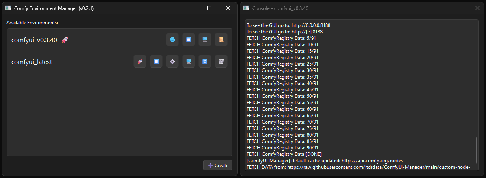

# ComfyEnv: An Environment Manager for ComfyUI



ComfyUI is incredibly flexible, but installing different custom nodes or dependencies often leads to conflicts that can break existing setups. **ComfyEnv** helps you manage isolated environments, so each project or node set can live in its own stable sandbox.

> **Supported Platforms:**
>
> ✅ Windows
> ✅ Linux
> ❌ macOS is currently **not supported**

---

## Features

- Isolated **Conda environments** per ComfyUI setup
- Install and run ComfyUI without dependency conflicts
- Clean separation of node configurations
- CLI and GUI interface for managing environments
- Flexibility to configure the environments

---

## Requirements

Before using ComfyEnv, make sure the following are installed:

- [Miniconda3](https://www.anaconda.com/download/success)
- [Git](https://git-scm.com/)

---

## Installation

```bash
conda activate
git clone https://github.com/cancer32/ComfyEnv.git
cd ComfyEnv
pip install -r requirements.txt

chmod +x bin/comfy-env bin/env-manager            # For Linux Only
```

### ⚠️ Set CONDA_ROOT envirnoment variable (if it gives error) 

- Set the `CONDA_ROOT` environment variable to the root path of your Miniconda installation eg. `C:\ProgramData\miniconda3` in the user's startup profile
- **OR** edit the `bin/_conda_root[.bat]`, uncomment the below line, set the `CONDA_ROOT` path and Save.

  **Windows** `bin/_conda_root.bat`

  ```bat
  REM ##########################################
  REM Uncomment and set CONDA_ROOT path below
  set CONDA_ROOT=/path/to/miniconda3
  REM ##########################################
  ```

  **Linux** `bin/_conda_root`

  ```bash
  ##########################################
  # Uncomment and set CONDA_ROOT path below
  export CONDA_ROOT=/path/to/miniconda3
  ##########################################
  ```

---

## Directory Structure

```
ComfyEnv/
├── bin/
│   └── comfy-env        # The main CLI interface
│   └── env-manager      # The main GUI interface
├── envs/                # Contains all isolated environments
│   └── <env_name>/      # A specific ComfyUI environment
├── models/              # Shared models directory accessible to all environments
│   └── checkpoints/
│   └── vae/
│   └── .../
```

---

## `comfy-env` Usage

```bash
# Create a new environment
# Note: Edit "torch_requirements.txt" file if you want to install specific pytorch version for environment
bin/comfy-env create -n my-env --python=3.12 --comfyui-version=v0.3.43

# List all environments
bin/comfy-env list

# Run ComfyUI inside an environment
bin/comfy-env run -n my-env -- [comfyui args]

# Stop ComfyUI running in an environment
bin/comfy-env stop -n my-env
```